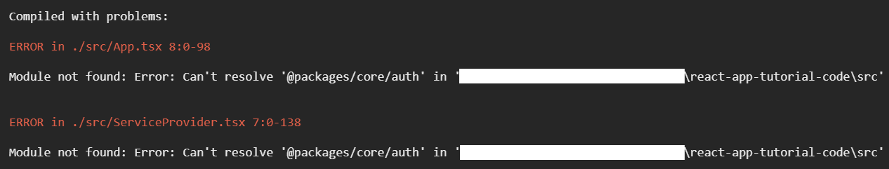

[« previous](01-setup.md) | [next »](03-routing.md)

## 2. Authentication
To provide a nice user experience we need to know who our app visitors are.
We need some sort of current user object and user cache mechanism.
We are going to build that in this chapter.

### 2.1 Separated `packages/` folder
Not only with testing in mind, but also in consideration of the principle of
[low coupling and high cohesion](https://stackoverflow.com/questions/14000762/what-does-low-in-coupling-and-high-in-cohesion-mean),
I think it makes sense to write the `auth` logic as independent as possible.
Best case scenario would be to be able to reuse the logic for another app.
This other app could for example be a smaller app for embedding some chosen contents in an iframe
which is rendered by an external website. Let's extract such logic into a separate `packages/` folder.

Sometimes the boundary between app logic and package logic can be really opaque.
In such a case I suggest creating the logic in the app's folder and extracting
your code into the `packages/` folder [only when you need it](https://martinfowler.com/bliki/Yagni.html)
at a later time.

I think our authentication and authorization logic is well accommodated in the `packages/core/auth` folder.

### 2.2 The auth user object
Whenever a user visits a website or an app, this user can either be identified as an anonymous or logged-in user.
The sentence before already implies, that we need two different types of a current user object.
One for an anonymous and one for a logged-in user.
So let's create these two with a generic, which is distinguishable by its `type` property.

> :bulb: The automatic type cast for a union type to one of its specific types can be reached with a condition on its unique value of the specific type's property, which is defined at the generic type, which is the base for every specific type of the union type.

So let's add following files to the codebase:

```typescript
// src/packages/core/auth/authUser.ts

type AuthUserType = 'anonymous' | 'authenticated';
type GenericUser<T extends AuthUserType, Payload extends object = {}> = {
    type: T;
} & Payload;
type UserData = { id: string; username: string };
export type AnonymousAuthUser = GenericUser<'anonymous'>;
export type AuthenticatedAuthUser = GenericUser<'authenticated', { apiKey: string; data: UserData }>;
export type AuthUser = AnonymousAuthUser | AuthenticatedAuthUser;
```

If we had some sort of user permissions, the `GenericUser` would be the right type definition to place them.
For now, we keep it simple.

### 2.3 DI, types and interfaces
We should never reference a service directly by its implementation,
otherwise you won't be able to properly test your components or other code you've written.
That's also true for React apps.
A good practise to prevent from directly coupled service implementations is the combination of
[dependency injection (DI)](https://stackify.com/dependency-injection/) with interfaces.
In React, we can reach DI with the [useContext hook](https://reactjs.org/docs/hooks-reference.html#usecontext).
At newer versions of TS, types and interfaces are nearly the same.
The only difference is that interfaces have the drawback to implicitly merge their definitions.
So let's go with types.

### 2.4 Current user and its repository hooks
After we defined the type `AuthUser` for a website visitor, we need a custom `useCurrentUser` hook
to reach the current user in every component no matter how nested it is.
We also need a repository (a service) to keep the current user after a page refresh has been done.
We should be able to mock/stub this service for testing purposes.
Let's try to write these requirements down in form of code:

```typescript
// src/packages/core/auth/currentUser.ts

import { AnonymousAuthUser, AuthUser } from './authUser';
import { createContext, useContext } from 'react';

const currentUserContext = createContext<null | AuthUser>(null);

export const CurrentUserProvider = currentUserContext.Provider;

export const anonymousAuthUser: AnonymousAuthUser = { type: 'anonymous' };

export function useCurrentUser(): AuthUser {
    const currentUser = useContext(currentUserContext);
    if (!currentUser) {
        throw new Error(`no AuthUser was provided`);
    }
    return currentUser;
}
```
and

```typescript
// src/packages/core/auth/currentUserRepository.ts

import { createContext, useContext } from 'react';
import { AuthUser } from './authUser';
import { anonymousAuthUser } from './currentUser';

export type CurrentUserRepository = {
    setCurrentUser(currentUser: AuthUser): void;
    init: () => void;
};

type CurrentUserStateSetter = (currentUser: AuthUser) => void;

export class BrowserCurrentUserRepository implements CurrentUserRepository {
    private readonly setCurrentUserState: CurrentUserStateSetter;

    constructor(setCurrentUserState: CurrentUserStateSetter) {
        this.setCurrentUserState = setCurrentUserState;
    }

    setCurrentUser(currentUser: AuthUser) {
        this.setCurrentUserState(currentUser);
        if (currentUser.type === 'anonymous') {
            localStorage.removeItem('currentUser');
            return;
        }
        localStorage.setItem('currentUser', JSON.stringify(currentUser));
    }

    init() {
        const currentUserStr = localStorage.getItem('currentUser');
        if (!currentUserStr) {
            this.setCurrentUser(anonymousAuthUser);
            return;
        }
        const currentUser = JSON.parse(currentUserStr) as AuthUser;
        this.setCurrentUser(currentUser);
    }
}

const currentUserRepositoryContext = createContext<CurrentUserRepository | null>(null);
export const CurrentUserRepositoryProvider = currentUserRepositoryContext.Provider;

export function useCurrentUserRepository(): CurrentUserRepository {
    const repo = useContext(currentUserRepositoryContext);
    if (!repo) {
        throw new Error(`no CurrentUserRepository was provided`);
    }
    return repo;
}
```
In Node, it is usual to provide a package's public API by an index file.
So to properly finalize our `auth` package we also add this clue code.

```typescript
// src/packages/core/auth/index.ts

export * from './authUser';
export * from './currentUser';
export * from './currentUserRepository';
```
Well done! We've created our first independent package code.
Let's use it in our app now!

### 2.5 Using the auth package
With DI, we usually need something like a service container which provides our service implementations.
So let's create a service provider component to provide our required services and states to all of its nested child components.
These services or states can be accessed by custom hooks, like the `useCurrentUserRepository` or `useCurrentUser` hooks we have written.

```typescript jsx
// src/ServiceProvider.tsx

import React, { FC, PropsWithChildren, useRef, useState } from 'react';
import {
    anonymousAuthUser,
    AuthUser,
    BrowserCurrentUserRepository,
    CurrentUserProvider,
    CurrentUserRepositoryProvider,
} from './packages/core/auth';

export const ServiceProvider: FC<PropsWithChildren<{}>> = (props) => {
    const [currentUserState, setCurrentUserState] = useState<AuthUser>(anonymousAuthUser);
    const browserCurrentUserRepositoryRef = useRef(new BrowserCurrentUserRepository(setCurrentUserState));
    return (
        <CurrentUserRepositoryProvider value={browserCurrentUserRepositoryRef.current}>
            <CurrentUserProvider value={currentUserState}>{props.children}</CurrentUserProvider>
        </CurrentUserRepositoryProvider>
    );
};
```
We should wrap our app directly in the entry point which is responsible to bootstrap the app in the browser,
because this service provider bootstraps the service implementations for browser environments
(e.g. see `BrowserCurrentUserRepository`).
So let's extend the given `index.tsx` with our created service provider
and make sure that the `<App>` component is wrapped with it.

```typescript jsx
// src/index.tsx

import React from 'react';
import ReactDOM from 'react-dom/client';
import App from './App';
import reportWebVitals from './reportWebVitals';
import { ServiceProvider } from './ServiceProvider';

const root = ReactDOM.createRoot(document.getElementById('root') as HTMLElement);
root.render(
    <React.StrictMode>
        <ServiceProvider>
            <App />
        </ServiceProvider>
    </React.StrictMode>
);
```

To see the result of our code, just make sure the `src/App.tsx` looks as below. Then, open your browser at
[localhost:3000](http://localhost:3000).

```typescript jsx
// src/App.tsx

import React, { MouseEvent, useEffect } from 'react';
import { anonymousAuthUser, useCurrentUser, useCurrentUserRepository } from './packages/core/auth';

function CurrentUserPlayground() {
    const currentUserRepo = useCurrentUserRepository();
    const currentUser = useCurrentUser();
    const isLoggedIn = currentUser.type === 'authenticated';
    function loginUser(event: MouseEvent<HTMLAnchorElement>) {
        event.preventDefault();
        currentUserRepo.setCurrentUser({
            type: 'authenticated',
            apiKey: 'foo',
            data: {
                id: 'foo',
                username: 'Linus',
            },
        });
    }
    function logoutUser(event: MouseEvent<HTMLAnchorElement>) {
        event.preventDefault();
        currentUserRepo.setCurrentUser(anonymousAuthUser);
    }
    return (
        <div className="App">
            <div
                style={{
                    marginLeft: 'auto',
                    marginRight: 'auto',
                    width: '600px',
                    textAlign: 'center',
                }}
            >
            {!isLoggedIn && (
                <a href="#" onClick={loginUser}>
                    login
                </a>
            )}
            {isLoggedIn && (
                <a href="#" onClick={logoutUser}>
                    logout
                </a>
            )}
                :: {currentUser.type === 'authenticated' ? currentUser.data.username : 'Anonymous'}
            </div>
        </div>
    );
}

function App() {
    const currentUserRepo = useCurrentUserRepository();
    useEffect(() => {
        currentUserRepo.init();
    }, [currentUserRepo]);
    return <CurrentUserPlayground />;
}

export default App;
```
You should be able to change the current user's state by clicking the "login" and "logout" links.
The current user should not change after a page refresh. This is reached with `CurrentUserRepository`
whose implementation stores the current user in the browser's local storage.
The `<App>` initializes the current user by looking at the local storage at first render.

> :bulb: A `useEffect` hook, having an empty dependency array (second parameter) does correspond to a
> `componentDidMount` hook of a class component.

### 2.6 Services for the testing environment
As you already might have noticed, there is a `src/App.test.tsx` file.
As we learned before, the `<App />` in `App.test.tsx` should not be bootstrapped
with browser service implementations like `BrowserCurrentUserRepository`.
`BrowserCurrentUserRepository` is using the browser's local storage,
but our tests just run locally in the console and not in a browser.
So let's create a service provider for the testing environment which should contain
either compatible or mocked services which are fulfilling the services' interfaces.

```typescript jsx
// src/TestServiceProvider.tsx

import {
    anonymousAuthUser,
    AuthUser,
    CurrentUserProvider,
    CurrentUserRepository,
    CurrentUserRepositoryProvider,
} from './packages/core/auth';
import React, { FC, PropsWithChildren, useRef } from 'react';

class StubCurrentUserRepository implements CurrentUserRepository {
    setCurrentUser(currentUser: AuthUser) {}
    init() {}
}

export const TestServiceProvider: FC<PropsWithChildren<{}>> = (props) => {
    const stubCurrentUserRepositoryRef = useRef(new StubCurrentUserRepository());
    return (
        <CurrentUserRepositoryProvider value={stubCurrentUserRepositoryRef.current}>
            <CurrentUserProvider value={anonymousAuthUser}>{props.children}</CurrentUserProvider>
        </CurrentUserRepositoryProvider>
    );
};
```

We should wrap the `<App>` with it in the testing environment:

```typescript jsx
// src/App.test.tsx

import React from 'react';
import { render } from '@testing-library/react';
import App from './App';
import { TestServiceProvider } from './TestServiceProvider';

test('renders app', () => {
    render(
        <TestServiceProvider>
            <App />
        </TestServiceProvider>
    );
});
```
You should be able to check it by running `npm run test`. Well done!

:floppy_disk: [branch 02-auth-1](https://github.com/inkognitro/react-app-tutorial-code/compare/01-setup...02-auth-1)

### 2.7 Ramp up our import paths
To not always reference to our packages folder by a relative import path,
we can alias our `packages` folder with `@packages`.
At the moment we have not too many imports to adjust yet, so I think it's the right time to do this.
This one could be a bit hard for developers without knowledge about Webpack, Typescript or even Jest.
So let's get our hands dirty.

First let's adjust our imports and replace every `import {...} from "./packages/core/auth";` with
`import {...} from "@packages/core/auth";`. Following files are affected:
- `src/App.tsx`
- `src/ServiceProvider.tsx`
- `src/TestServiceProvider.tsx`

Adjust the `package.json` file by adding following section to it:
```json
  "jest": {
    "moduleNameMapper": {
      "@packages/(.*)": "<rootDir>/src/packages/$1"
    }
  },
```
This makes sure, that our [jest](https://jestjs.io/) test runner is aware of the alias.

Next, append following properties in the `compilerOptions` property at the `tsconfig.json` file.
So TS is also aware of our alias.
```json
"baseUrl": ".",
"paths": {
  "@packages/*": ["src/packages/*"]
}
```

Now run the app with `npm run start` and switch to the browser at `localhost:3000`.

D'oh... does not seem to work yet :scream:



This is because [webpack](https://webpack.js.org) doesn't know anything about our alias yet.
The webpack configuration file is located in the [create-react-app](https://create-react-app.dev) template, on which
we have no access to.
Damn it... time to eject our [create-react-app](https://create-react-app.dev) template came faster than I expected:

Run `npm run eject` in the root of the project, type in `y` and finally, press `Enter` to confirm.
This leaks all the configuration files of our installed [create-react-app](https://create-react-app.dev) template
and gives us the advantage of more configuration possibilities.
On the other hand and from now on, we need to update all the packages on our own. What a pity!
If you look at the `package.json` file, you'll probably recognize that the list of packages became a lot bigger.
Anyway, I think for a clean codebase it is worth it.

Now, let's add the last piece to make our import alias work and add the following section in the
`config/webpack.config.js`, so that the `alias` property is also aware of our packages:

```js
"alias": {
  "@packages": path.resolve(__dirname, '../src/packages'),
  // other stuff...
}
```
Restart the app and check the browser. Everything should work as expected now, including our `@packages` alias.

:floppy_disk: [branch 02-auth-2](https://github.com/inkognitro/react-app-tutorial-code/compare/02-auth-1...02-auth-2)

[« previous](01-setup.md) | [next »](03-routing.md)