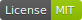

# react-app-tutorial
The purpose of this tutorial is to better understand the concepts of React and to build a framework on top of it.
To go through this tutorial without a lot of pain, you should be familiar with Javascript ES6+, React and JSX.
This tutorial is written in Typescript, but I think most people who understand Javascript can also learn
Typescript by doing this tutorial. No need to panic: It is just "javascript with type hints".

### What we are going to build together
Together we are going to build a single page app with an `index` and a `register user page`.
The user registration form is going to be wired with a mocked api over http to also cover network traffic.
The output of this tutorial is a clean and reusable framework built on top of react.

### Out of scope
We do not cover [redux](https://redux.js.org/) in this tutorial.
In my opinion and especially in this time (with React 16+) I think redux is an overkill for most cases.
The trade-off between redux's code-splitting and therefore its higher complexity overwhelms the benefits of
performance optimizations. I experienced that encapsulated components with its callbacks are a lot easier to understand and
less error prone than reducers, actions and components which are split into different parts in the code base.
For global and non steadily changed state I would suggest using the React's `useContext` hook.

### Tutorial steps
Below you can see an overview of all steps of this tutorial.

1. [Setup from scratch](01-setup.md) - Installation from create-react-app, setup structure, install packages
2. [Routing](02-routing.md) - Prepare page layouts and the page's skeletons
3. [Current user (auth)](03-auth.md) - Create an authorization context for the current user

[Let's start »](01-setup.md)

### Tutorial steps
1. Setup react app from scratch
   - installation with create-react-app
   - code structure (packages/core, spa) and the "whys" (take explanations from coding guidelines)
   - routing with react-router-dom
   - install material ui
   - install styled-components (reference VueJs strategy)
2. Pages skeletons
   - page layout
   - navigation
   - index page
   - register user page
3. CurrentUser
   - define current user types
   - define `useCurrentUser` hook
   - define `CurrentUserRepository` and its hook
   - adjust navigation (add username when current user is logged in)
4. Translator (i18n)
   - setup translation with `i18next`
   - `useTranslator` hook
   - `Translation` component with `ReactNode` placeholders
   - setup context
5. Utilities
   - `Message` type and `Message(s)` component
6. Toaster
   - define toaster types
   - define `SubscribableToaster` class
   - setup context
   - create toaster with MUI
   - implement toaster component in root
   - create a link to dispatch a toast at index page
7. Collections and Providers
   - define types
   - createArrayProvider
   - explanation that this should also be done for `api-v1` collections
8. Form elements
   - form element type definitions
   - `TextField`, `Dropdown` (use `Messages` component from utilities)
   - Error message enrichment by `modifier` function
   - Provide the user registration form skeleton
9. ApiV1
   - create [axios](https://axios-http.com) `http` request handler
   - create ApiV1RequestHandler
   - define `registerUserEndpoint.ts` with `shouldFail: boolean` param
   - build the `useApiV1RequestHandler` hook, open for middleware
10. Wire the User registration form
    - use the `useApiV1RequestHandler` hook
    - make two buttons `registerAndSucceed` and `registerAndFail` 
    - extend the `useApiV1RequestHandler` hook with `showToastMessages: boolean` and its middleware
11. Summing up
    - What to do next: Optimize with [NextJs](https://nextjs.org)?
    - Some differences to current architecture in naming (Provided Vs. Provider)